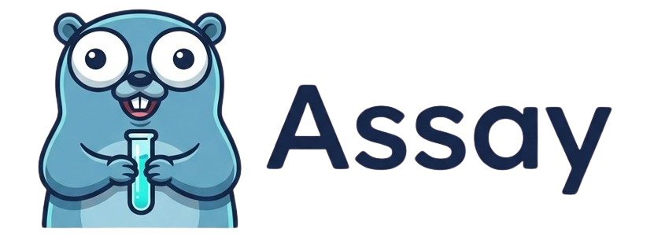

<p align="center">
  
</p>

**LLM tracing + evaluation in one Go binary and a Postgres.** OTLP-native, judges built in, agent-operable — the self-host that isn't a six-container science project.

Assay ingests traces over OpenTelemetry (OTLP), stores them in Postgres, and runs LLM-as-judge scorers (**groundedness** + **correctness** in v1) both **online** (on live traces) and **offline** (on datasets) — with a Python client, a CLI, and a Claude Code skill so an agent can drive the whole loop.

- **Two components, forever:** `assayd` (single Go binary — API + embedded worker) + Postgres. No ClickHouse, Redis, S3, or Kafka.
- **OTLP-native:** send from any OpenTelemetry SDK (or the ergonomic `assay` Python library). Zero lock-in — plain, exportable Postgres at rest.
- **Judges where your data lives:** groundedness (claim-decomposition) and correctness (reference-based), computed with no extra infrastructure, CI-gate-able.
- **Agent-native:** CLI + Claude Code skill turn a production failure into a regression test.
- **Batteries-included UI:** a minimal React SPA is embedded in the binary (served at `/`) — no extra container. (v1 is a single-user test UI; real login comes later.)
- **License:** Apache-2.0.

> Built for individual developers, small teams, and self-hosters running under ~1M spans/day. **Not** for billion-span enterprises needing SSO/RBAC/HA — that's what the heavy platforms are for.

## Status

M1 domain and authentication implemented: project, API-key, and application APIs; admin bearer
authentication; encrypted write-only secrets; hashed project keys; and generated OpenAPI 3.1 docs.
OTLP trace ingestion begins in M2.

The implementation follows these references:

- **Design & build plan:** [`docs/specs/2026-08-26-assay-design.md`](docs/specs/2026-08-26-assay-design.md)
- **Semantic conventions (trace attribute contract):** [`docs/semantic-conventions.md`](docs/semantic-conventions.md)
- **CI/CD plan (pinned versions):** [`docs/ci-cd.md`](docs/ci-cd.md)
- **Agent skill:** [`.claude/skills/assay/SKILL.md`](.claude/skills/assay/SKILL.md)

## Python SDK

Install the Python distribution from PyPI with uv:

```bash
uv add assay-sdk
```

The distribution is named `assay-sdk` and imported as `assay`:

```python
import assay

print(assay.__version__)
```

Version 0.1.0 is a bootstrap release that establishes the package name and import namespace.
The tracing, API client, and CLI interfaces described below remain planned for milestone M5.

## Repo layout

```
assayd/                 # Go 1.27 backend (single binary): API + OTLP receiver + embedded worker + UI
web/                     # React + Vite + Tailwind + shadcn/ui SPA (embedded into the binary)
clients/python/assay/   # assay-sdk distribution; functional SDK lands in M5
.claude/skills/assay/    # Claude Code skill wrapping the CLI
assets/                  # reusable brand assets, including the transparent app icon
docs/                    # design spec and supporting documentation
```

## Deployment

One binary, one Postgres — two ways to run it:

- **Standalone / local:** `docker compose up` (assayd + postgres). One command; migrations auto-apply on start.
- **Scale:** assayd container(s) against a managed/separate Postgres; add replicas for worker capacity (the queue lives in Postgres). No SQLite, no object store — Postgres only.

## Development quickstart

```bash
cp .env.example .env       # PowerShell: Copy-Item .env.example .env
docker compose up          # assayd + postgres; migrations auto-apply on start
```

Create the first project, API key, and application from PowerShell:

```powershell
$adminToken = Read-Host "ASSAY_ADMIN_TOKEN from .env"
$headers = @{ Authorization = "Bearer $adminToken" }
$project = Invoke-RestMethod -Method Post -Uri http://localhost:8080/v1/projects `
  -Headers $headers -ContentType application/json -Body '{"name":"support"}'
$key = Invoke-RestMethod -Method Post `
  -Uri "http://localhost:8080/v1/projects/$($project.id)/keys" `
  -Headers $headers -ContentType application/json -Body '{"name":"local"}'
$appBody = @{ project_id = $project.id; name = "Support Bot"; slug = "support-bot" } |
  ConvertTo-Json
$application = Invoke-RestMethod -Method Post -Uri http://localhost:8080/v1/applications `
  -Headers $headers -ContentType application/json -Body $appBody
$key.key # Save now: the plaintext key is returned only once.
```

OpenAPI is available at `http://localhost:8080/openapi.json`; interactive docs are at
`http://localhost:8080/docs`.

```python
import assay
assay.init(endpoint="http://localhost:8080", api_key="asy_...",
           project="my-project", application="support-bot")

@assay.trace
def answer(q: str) -> str:
    ...
```
